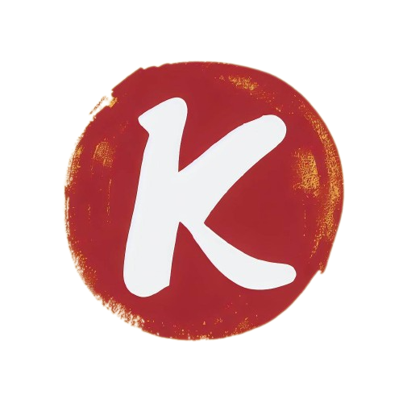

# kartik Barhate's Portfolio

## About Me

Hi, I'm kartik Barhate👋, a Fullstack Developer, Selenium Tester, AI and ML Practitioner, and Blockchain Developer. I have extensive experience in JavaScript, React, Node.js, and blockchain technologies. My portfolio includes building decentralized applications, utilizing machine learning algorithms, and crafting augmented reality experiences. Let's collaborate on your next cutting-edge project!

- **LinkedIn**: [Profile](https://www.linkedin.com/in/kartik-kanotra/)
- **GitHub**: [Profile](https://github.com/kartik0649)
- **Email**: [Email Me](mailto:kartikkanotra@gmail.com)

## Introduction

I thrive on technical challenges and am committed to delivering scalable and efficient solutions. My work experience ranges from internships at Samsung Research to Software Developer at Visa Inc.

### Work Experience

- **AiBlocks**: Founding Engineer (Oct 2023 - April 2024)
- **Bosch India**: Summer Intern (May 2023 - June 2023)
- **Backend Helping AI**: Software Engineer Intern (Jan 2022 – Jan 2023)
- **Surya Nestbuild Limited**: Web Developer Intern (May 2021 – July 2021)

## How to Run This Repository

1. **Clone the Repository**: `git clone https://github.com/your-username/your-repo-name.git`
2. **Navigate to the Directory**: `cd your-repo-name`
3. **Install Dependencies**: `npm install`
4. **Start the Development Server**: `npm run dev`
5. **Open in Browser**: Navigate to `http://localhost:3000` in your browser.

## Get in Touch

Feel free to reach out to me through [LinkedIn](https://www.linkedin.com/in/kartikbarhate/), [GitHub](https://github.com/kartikBarhate), or [Email](mailto:barhate.kartik@gmail.com).

